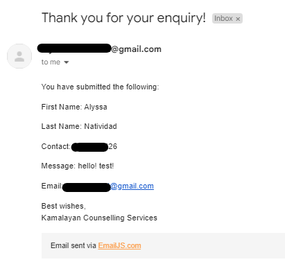
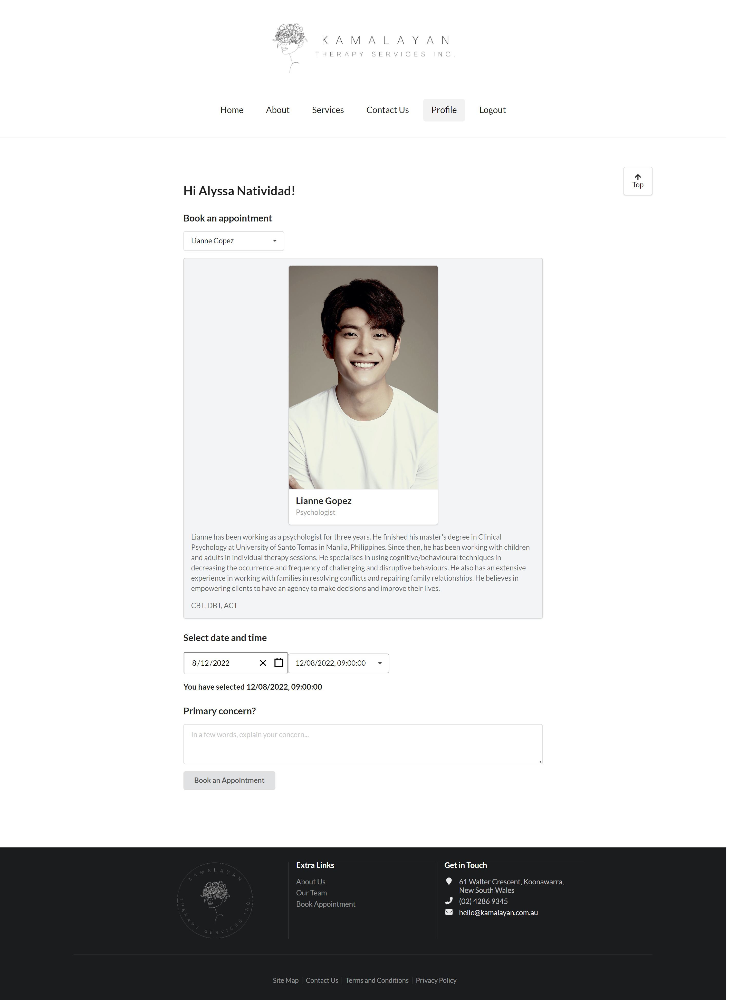
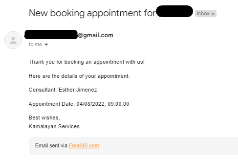
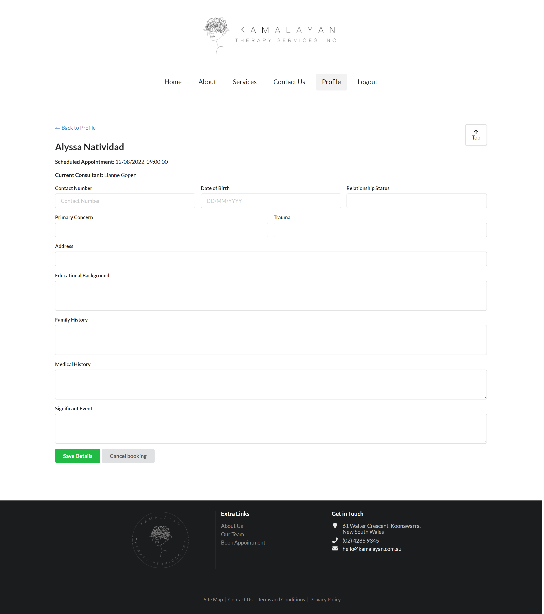
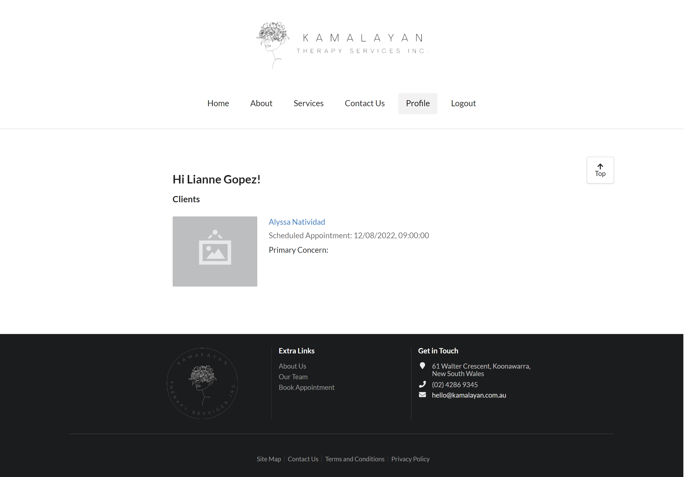
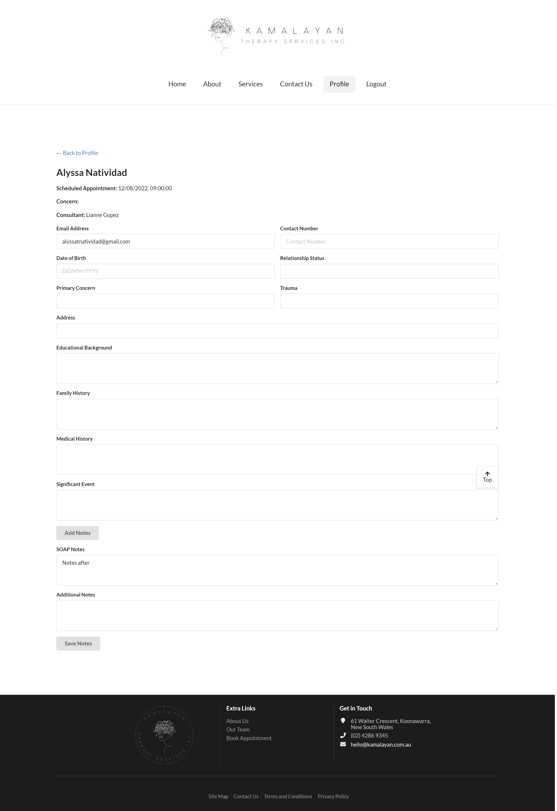

# Kamalayan Therapy Services

## Table of contents

- [Description](#Description)
- [Website](#Website)
- [Features](#Features)
- [Credits](#Credits)
- [Questions](#Questions)

## Description

Kamalayan Therapy Services is a full stack MERN single-page application where users, both clients and consultants, can view information about the company, send enquiries, sign up and log in. Logged in clients can also create, view, and cancel appointments to their chosen consultants, modify and update their own client details. Consultants can also view the booked clients' details and add notes regarding their appointments.

This application uses node.JS, Express.js, MongDB, React with Semantic-UI. Additional packages needed for this application to run are `JWT` for user authentication, `GraphQL API` and `Apollo Client and Server`, `bcrypt`, `express`, `EmailJS`, and `React-Date-Picker`.

## Website

Visit [this](https://kamalayantherapyservices.herokuapp.com/) to see the application in action.

## Features

The application contains several pages that contains information for someone that is curious about seeking therapy.

The hompage contains a short description of the company's aim, several issues tackled in therapy and the type of therapy services the company offers.


The About page contains the Mission, Vision, and Values of the company as well as the consultants and their information who are working for the company. The Services page contains a short description of each treatments and services offered. And a Contact Us page that contains a form which can be filled out with enquiries and questions. After submitting the form, an email will be sent to the email address entered containing the details entered on the form. The enquiry is also saved backend.



A user of this application can either be a client or a consultant. A person who wants to create an appointment for a consultation is a client, while the person offering the service is a consultant.

A client needs to sign up and login before booking. Once logged in, they can select on which consultant to book along with the date and time of the appointment. They can also include their main concern along with their appointment.



The client will be sent an email containing the appointment information.



Once that is done, the user can now modify their information that would be useful for the consultants especially when meeting for the first time. They can also cancel their appointment if they wanted to have their session in another date or time.



On the other hand, a consultant can log in to see which clients have created an appointment with them, when that is scheduled, and can also see their relevant details.



They can also add post-appointment notes about their client for assessment.



## Installation

After forking the project into your local computer, run the following to install all of the packages used in this program:

```
npm install
```

Create a copy of the .env.EXAMPLE file, fill out the URI of your MongoDB, and JWT Token and save the file into .env

After that, the database tables will need to be seeded by running

```
cd ../client
npm run seed
```

## Usage

To run the program, run the code below:

```
npm run develop
```

A new tab will open with the web application.

Once presented with the homepage, navigate to either the signup, or login pages depending on whether you are a returning user or not. You can do this by clicking the relevant button in the top right of the screen.

If logging in as a client, you can either create an appointment with a consultant, just view your details (you already have a booked appointment), or cancel an apointment.

If logging in as a consultant, you can see the clients that have created an appointment and their details.

## Credits

This project was completed by [Alyssa Natividad](https://github.com/alainatividad).

The React Date Picker is by [Wojciech Maj](https://github.com/wojtekmaj/react-date-picker).

[EmailJS](https://www.emailjs.com/)

## Questions

Please also direct questions to: Alyssa Natividad, https://github.com/alainatividad or alyssatnatividad@gmail.com.
